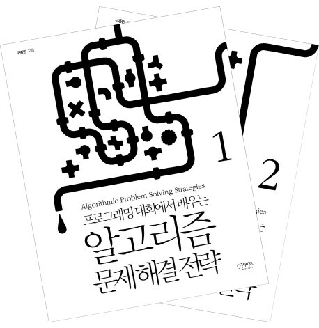

# 프로그래밍 대회에서 배우는 알고리즘 문제 해결 전략 세트

- 구종만 지음 | 인사이트 | 1062쪽
- [책 소개](http://www.yes24.com/24/goods/8006522?scode=032&OzSrank=1)
- [알고스팟 운영자](https://algospot.com/)
- [Python Algorithm](http://interactivepython.org/courselib/static/pythonds/index.html): 이 책이 파이썬으로 되어 있어서 굉장히 좋다. interactive 하게 알고리즘들을 확인할 수 있다.

## 이 책을 선택한 이유

- 알고리즘을 공부해 보고 싶어서
- 알고리즘을 모르면 사상누각

## 이 책을 정리하면서 들었던 생각

- 엄청나게 정리가 잘되어 있다.
- 파이썬으로 되어 있었다면 얼마나 좋았을까? 라는 생각을 잠시나마 했다.
- 근데 C++ 코드로 되어 있고 어차피 몇가지 문법만 다를뿐이지 로직은 똑같기에 파이썬으로 포팅하는데 크게 어려움은 없었다.

## IPython으로 정리한 내용

- [Mismatched Brackets](http://nbviewer.ipython.org/github/re4lfl0w/ipython/blob/master/books/Algorithmic_Problem_Solving_Strategies/problems/BRACKETS2.ipynb): stack 관련 문제
- [Josephus](http://nbviewer.ipython.org/github/re4lfl0w/ipython/blob/master/books/Algorithmic_Problem_Solving_Strategies/problems/JOSEPHUS.ipynb)